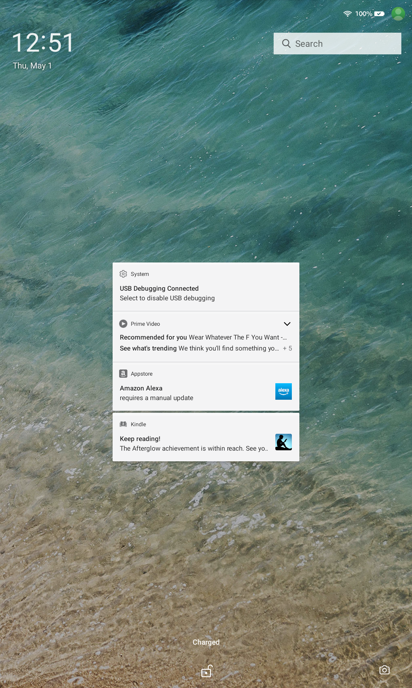

# XState Demo for Amazon Fire Tablet

This is a React Native application that demonstrates the usage of [XState](https://github.com/statelyai/xstate), a library for creating, interpreting, and executing finite state machines and statecharts.

## Features

This app showcases various state machine patterns:

1. **Traffic Light**
   - Simple state machine with automatic transitions
   - Timed transitions using `after` property
   - Visual representation of states

2. **Toggle Switch**
   - Basic toggle machine with context
   - Tracking state transitions with a counter
   - Displaying machine state and context

3. **Fetch Example**
   - API request state management
   - Loading, success, and error states
   - Request cancellation
   - Mock data handling

4. **Form Validation**
   - Form state management with validation
   - Error handling and display
   - Form submission with loading state
   - Server-side validation simulation

5. **Multi-step Wizard**
   - Complex multi-step form
   - State persistence between steps
   - Validation at each step
   - Progress tracking
   - Success and failure states

## Screenshot



## Implementation Details

The app demonstrates several key aspects of XState:

- **State Machines**: Creating and using finite state machines
- **Transitions**: Handling state transitions with events
- **Guards**: Conditional transitions based on context
- **Actions**: Side effects when transitions occur
- **Context**: Storing and updating data within the machine
- **Services**: Invoking promises and handling async operations
- **Delayed Transitions**: Automatic transitions after a delay

## XState Examples

```javascript
// Simple traffic light machine
const trafficLightMachine = createMachine({
  id: 'trafficLight',
  initial: 'green',
  states: {
    green: {
      on: {
        TIMER: 'yellow'
      },
      after: {
        3000: 'yellow'
      }
    },
    yellow: {
      on: {
        TIMER: 'red'
      },
      after: {
        1000: 'red'
      }
    },
    red: {
      on: {
        TIMER: 'green'
      },
      after: {
        4000: 'green'
      }
    }
  }
});

// Machine with context
const toggleMachine = createMachine({
  id: 'toggle',
  initial: 'inactive',
  context: {
    count: 0
  },
  states: {
    inactive: {
      on: {
        TOGGLE: {
          target: 'active',
          actions: assign({
            count: (context) => context.count + 1
          })
        }
      }
    },
    active: {
      on: {
        TOGGLE: {
          target: 'inactive',
          actions: assign({
            count: (context) => context.count + 1
          })
        }
      }
    }
  }
});

// Using the machine in a component
const [state, send] = useMachine(toggleMachine);

// Sending events
send('TOGGLE');

// Accessing state
state.value; // 'active' or 'inactive'
state.context.count; // Number of toggles
state.matches('active'); // Boolean check for current state
```

## Getting Started

1. Clone this repository:
   ```bash
   git clone https://github.com/mosesroth/xstate-demo.git
   cd xstate-demo
   ```

2. Install dependencies:
   ```bash
   npm install
   ```

3. Start the development server:
   ```bash
   npx expo start
   ```

4. To run on an Amazon Fire tablet:
   - Generate the bundle:
     ```bash
     npx react-native bundle --platform android --dev false --entry-file index.js --bundle-output android/app/src/main/assets/index.android.bundle --assets-dest android/app/src/main/res/
     ```
   - Build the APK:
     ```bash
     cd android && ./gradlew assembleDebug
     ```
   - Install on connected device:
     ```bash
     adb install -r app/build/outputs/apk/debug/app-debug.apk
     ```

## License

MIT
